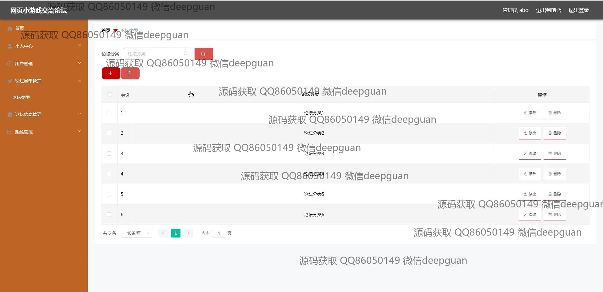
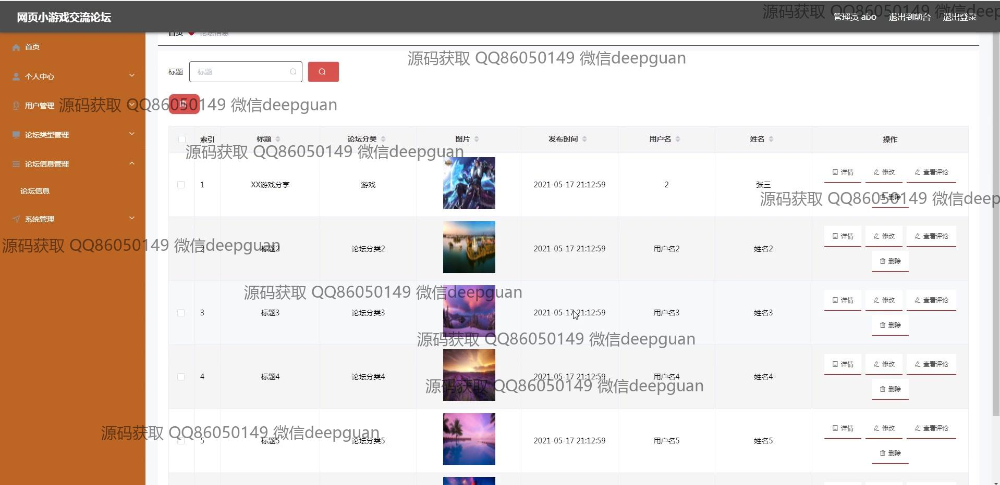

<h1 align="center">网页小游戏交流论坛+vue</h1>

## 简介
网页小游戏交流论坛是一个多功能平台，角色分为管理员和用户；功能包括帖子管理、用户注册登录、个人信息管理、轮播图管理和论坛互动等，支持用户交流与信息维护。    --计算机毕业设计源码；毕设源码；java毕业设计源码

## 联系方式

<h3 align="center">获取完整代码与数据库文件 + 微信：deepguan QQ: 86050149 QQ群: 783742310</h3>

<h3 align="center">可帮忙远程部署 包运行成功！提供远程部署、修改代码、设计文档指导、代码讲解等服务！</h3>

## 功能介绍（完整见运行截图）
管理员：登录、注册、退出功能，页面导航包括首页、个人中心、论坛信息管理和系统管理。管理功能涵盖用户管理、论坛类型管理、帖子管理及公告信息。支持添加、修改、删除及查看评论，管理轮播图和收藏夹功能，确保系统的流畅交互和内容更新。

用户：注册和登录后可访问首页、查看论坛内容及参与互动。支持发帖、点赞、踩以及评论功能。个人中心提供信息查看与修改，包括头像上传、密码更新及收藏管理。用户可通过搜索功能查找论坛内容，并在论坛信息管理中参与帖子发布和编辑。

## 运行截图

本代码来源于网络,仅供学习参考使用!

